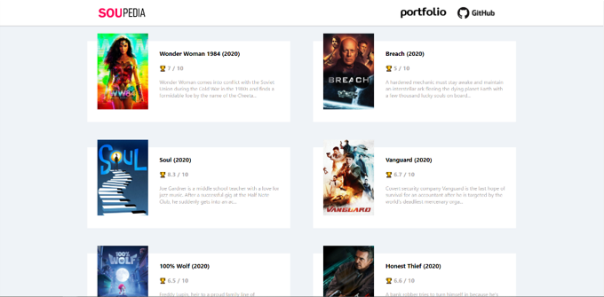
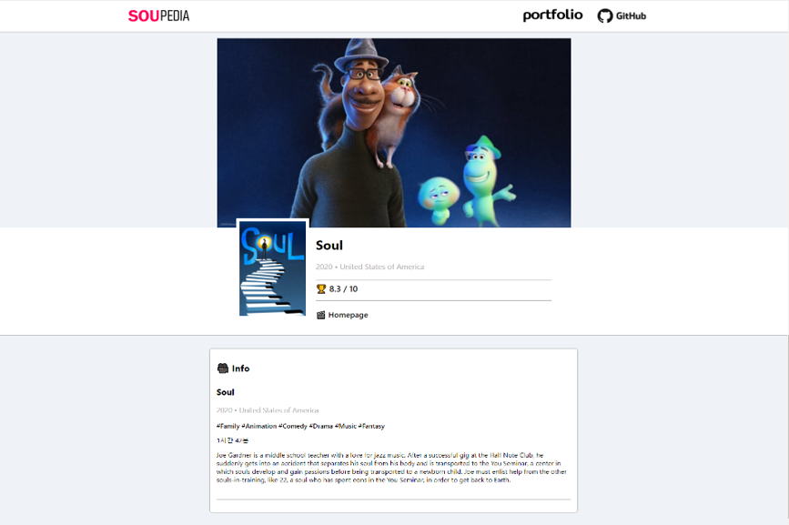

# 🎬 SOUPEDIA

> 노마드코더 Course 중 React JS로 영화 웹 서비스 만들기


**🎥Souvenir + WATCHPEDIA🎥**


## 💻 실행화면

### 🎡 리스트 페이지

 


### 🎡 상세 페이지

 


## 🎯 프로젝트 소개

**"SOUPEDIA는 영화 리스트와 해당 영화에 대한 상세 페이지를 볼 수 있습니다!"**

`SOUPEDIA`는 `React JS`를 사용하여 제작한 웹 어플리케이션입니다.

[TMDB](https://www.themoviedb.org/?language=ko) API를 사용하여 영화 리스트를 나타내고, 

상세 내용을 전달해주는 API를 사용하여 상세 페이지를 구현했습니다.😎

`gh-pages`를 통해서 배포했습니다.


## ⛳ 프로젝트 시작하기

### 🎨 Clone

```
git clone https://github.com/souvenir718/SOUPEDIA.git
```


### 🎨 Start

```
cd SOUPEDIA
npm install
npm start
```


### 🔗[배포주소](https://souvenir718.github.io/soupedia/)

### 🏆 [Certificate](https://github.com/souvenir718/TIL/blob/master/Certificate/ReactJS%EB%A1%9C%20%EC%98%81%ED%99%94%20%EC%9B%B9%20%EC%84%9C%EB%B9%84%EC%8A%A4%20%EB%A7%8C%EB%93%A4%EA%B8%B0.pdf)